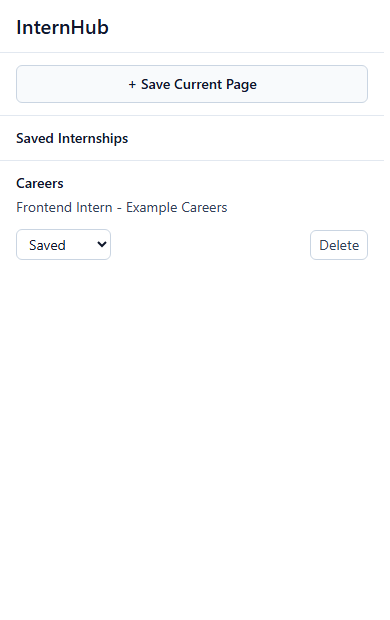
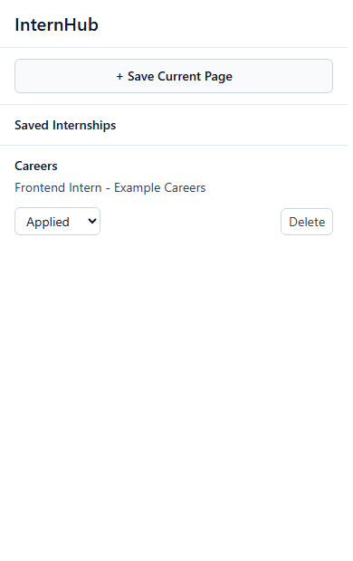
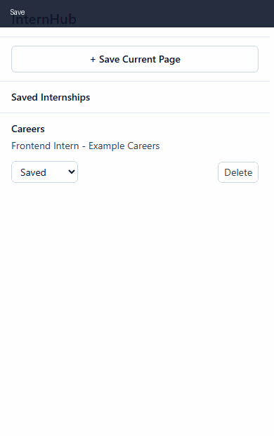

# InternHub Extension

InternHub Extension is a Chrome Extension MVP that helps students save internship listings from the current browser tab and track each application's status.

## Problem Statement

Students often discover internship opportunities across multiple job boards, company career pages, and shared links. Those links are easy to lose, and tracking whether an opportunity is saved, applied, interviewing, rejected, or converted to an offer quickly becomes messy.

InternHub keeps the first version focused: save the current page, persist it locally, update the status, and delete it when it is no longer needed.

## Features

- Save the active browser tab as an internship.
- Persist internships with `chrome.storage.local`.
- Prevent duplicate saved internships by URL.
- Update status to `Saved`, `Applied`, `Interview`, `Rejected`, or `Offer`.
- Delete saved internships.
- Show a helpful empty state when nothing is saved.
- Keep Chrome API calls isolated from React UI components.

## Tech Stack

- React
- TypeScript
- Vite
- Tailwind CSS
- Chrome Extension Manifest V3
- Chrome Storage API
- Git and GitHub

## Architecture

The project separates browser APIs, persistence, state coordination, and UI rendering.

```text
internhub-extension/
  public/
    icons/
      icon16.png
      icon32.png
      icon48.png
      icon128.png
    manifest.json
  src/
    components/
      Header.tsx
      InternshipCard.tsx
      InternshipList.tsx
      SaveButton.tsx
    hooks/
      useInternships.ts
    popup/
      Popup.tsx
    storage/
      internshipStorage.ts
    types/
      internship.ts
    utils/
      getCurrentTab.ts
```

### Responsibility Split

- `storage/internshipStorage.ts`: reads and writes internship records with `chrome.storage.local`.
- `utils/getCurrentTab.ts`: wraps `chrome.tabs.query`.
- `hooks/useInternships.ts`: coordinates loading, saving, status changes, deleting, and UI messages.
- `components/`: renders the popup UI and receives callbacks from the hook.

## Architecture Decisions

### Why Chrome APIs Are Isolated

Chrome APIs are kept in `storage/` and `utils/` so React components do not depend directly on browser-extension globals. This makes the UI easier to reason about, keeps components focused on rendering, and makes future testing or API changes less risky.

### Why `chrome.storage.local`

The MVP only needs local persistence on the user's browser. `chrome.storage.local` is built into Manifest V3, works without a backend or authentication, and keeps the project focused on the core workflow: save, track, update, and delete internships.

### Why a Custom Hook

`useInternships` acts as the workflow coordinator between UI events and persistence. The hook loads internships when the popup opens, saves the active tab, updates status, deletes records, refreshes state, and surfaces user-facing messages. This keeps the popup component small and keeps business flow out of presentational components.

## Data Model

```ts
export type InternshipStatus =
  "Saved" | "Applied" | "Interview" | "Rejected" | "Offer";

export interface Internship {
  id: string;
  title: string;
  company: string;
  url: string;
  status: InternshipStatus;
  savedAt: string;
}
```

## Installation

```bash
git clone https://github.com/ItzPranav61/internhub-extension.git
cd internhub-extension/internhub-extension
npm install
```

## Development

```bash
npm run dev
```

Vite runs the popup UI in a normal browser tab for frontend development. Chrome extension APIs are only available when the built extension is loaded in Chrome.

## Build

```bash
npm run build
```

The production extension build is created in:

```text
internhub-extension/dist
```

## Release Package

The loadable extension folder is:

```text
internhub-extension/dist
```

A zipped distributable is available at:

```text
release/internhub-extension-dist.zip
```

## Usage

1. Run `npm run build`.
2. Open Chrome and go to `chrome://extensions`.
3. Enable Developer mode.
4. Click Load unpacked.
5. Select `internhub-extension/dist`.
6. Visit an internship listing page.
7. Open the extension popup.
8. Click Save Current Page.
9. Change the status from the dropdown when needed.
10. Click Delete to remove a saved internship.

## Manual Test Flow

Last verified during Milestone 7:

1. Save an internship from the active tab.
2. Reload the popup and confirm the internship remains.
3. Change the saved internship status to `Applied`.
4. Reload the popup and confirm the status remains `Applied`.
5. Delete the internship.
6. Reload the popup and confirm the empty state appears.

Expected result:

- Saved data persists across popup sessions.
- Status changes persist.
- Deleted internships do not return.
- The empty state appears after deleting the last internship.

## Release Verification

- `npm run lint` passed.
- `npm run build` passed.
- The built `dist` folder was loaded in Chrome through `chrome://extensions`.
- The generated extension ID was detected from Chrome's extensions page.
- Persistence behavior was verified in the built extension context.
- The release package was zipped from the production `dist` output.

## Engineering Quality

- Unit tests cover storage helpers, duplicate detection, status updates, delete logic, tab lookup, and the `useInternships` hook.
- ESLint checks TypeScript and React hook rules.
- Prettier keeps formatting consistent.
- GitHub Actions runs install, lint, build, and tests on pushes and pull requests.
- Issue templates and a pull request template are included for a cleaner solo or team workflow.

## Screenshots

Screenshots are stored in `docs/screenshots/`.






## Demo



## Future Roadmap

- Polish popup spacing and visual hierarchy.
- Add edit support for title and company.
- Add filtering by status.
- Add search.
- Add optional confirmation before delete.
- Add export/import support.
- Prepare Chrome Web Store assets and listing.

## Current Scope Boundaries

This MVP intentionally does not include authentication, backend storage, Supabase, AI, reminders, notifications, website scraping, or Chrome Web Store setup.
